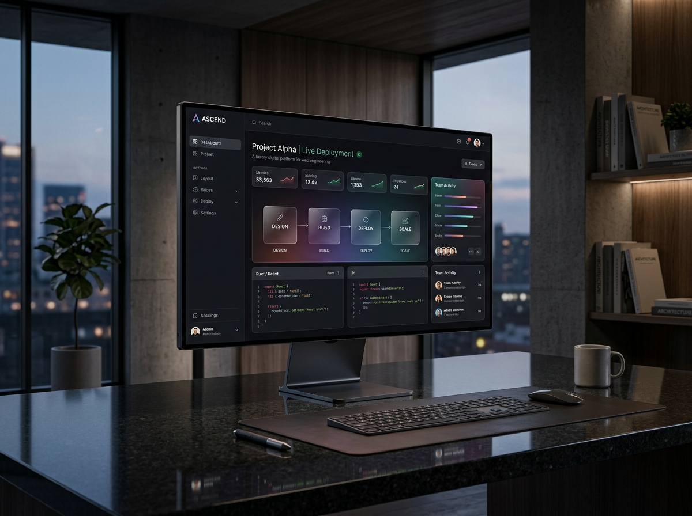
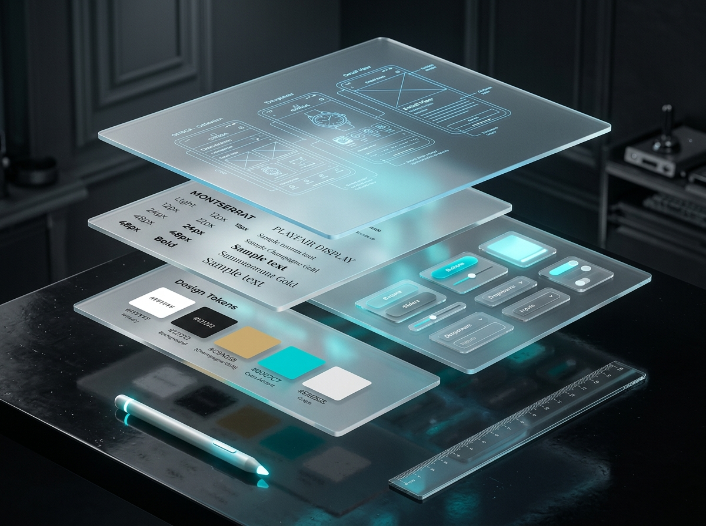
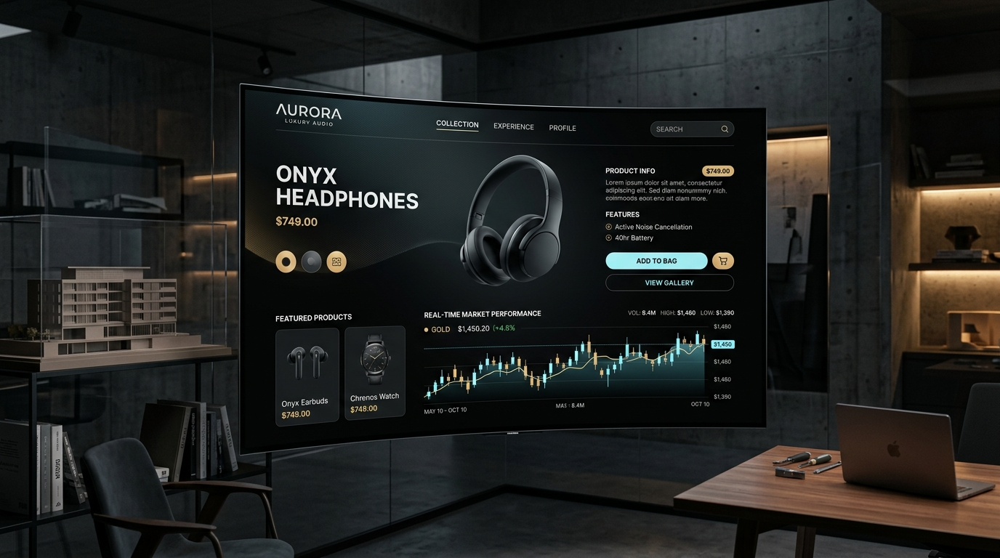

# NovaCrest Technologies (`novacrest.tech`)

> **Engineered Systems • Digital Products • Growth Architecture**

NovaCrest Technologies is a premium technology and digital solutions company designing, building, and scaling high-performance web applications, mobile apps, enterprise software, and search-driven growth systems for ambitious businesses worldwide.

---

## 🎨 Visual Design & Architectural Gallery

Below is the collection of custom cinematic visual assets engineered for NovaCrest Technologies:

### 1. Signature Hero & 3D Nucleus
| Homepage Hero Landscape | Prism Core 3D Nucleus |
|:---:|:---:|
|  |  |
| *Cinematic abstract landscape representing ideas becoming technology.* | *Kinetic crystalline optical sculpture reacting to 3D pointer physics.* |

### 2. Studio Culture, Collaboration & Transformation
| Human Collaboration & Vision | Studio Engineering Atelier | Continuous Transformation Odyssey |
|:---:|:---:|:---:|
|  |  |  |
| *Human imagination and disciplined software engineering.* | *Senior architects writing clean production code.* | *Continuous trajectory from idea to worldwide scale.* |

### 3. Engineering Disciplines & Capabilities
| Web Platforms (Next.js 16) | Native Mobile Systems (Flutter / RN) |
|:---:|:---:|
|  |  |
| *Sub-1.2s Edge LCP commerce platforms.* | *60 FPS native haptics & 1-tap biometrics.* |

| Bespoke Cloud Pipelines | UI/UX Design Token Systems |
|:---:|:---:|
|  |  |
| *Automated document parsing & ERP sync.* | *Clickable Figma prototypes & token systems.* |

| Technical SEO & AI Search (AEO) | Autonomous Commerce & Growth |
|:---:|:---:|
|  |  |
| *Rich schema markup & AI search citations.* | *Headless Shopify Plus & multi-currency routing.* |

### 4. Flagship Client Case Study
| Production Deployed Flagship Exhibit |
|:---:|
|  |
| *0.82s edge latency high-converting storefront architecture.* |

---

## 🗺️ Complete Page Architecture

| Route | Purpose | Schema / Capabilities |
|---|---|---|
| `/` | Flagship Homepage | 15-part conversion flow, bento grid, interactive hero, stack breakdown, FAQs, final CTA |
| `/services` | Services Hub | Directory of all 8 core services with feature breakdowns |
| `/services/[slug]` | Individual Service Pages | Dedicated pages for Web Dev, Mobile Apps, Custom Software, UI/UX, SEO, Marketing, E-Commerce, AI |
| `/solutions` | Commercial Solutions | Startup MVPs, Enterprise Modernization, E-Commerce Scale, Digital Transformation |
| `/industries` | Vertical Solutions | Healthcare, EdTech, FinTech, Retail, PropTech with challenges and solutions |
| `/work` | Portfolio & Case Studies | Problem / Solution / Verified Impact breakdown across real client scenarios |
| `/about` | Engineering Mission & Culture | Partner-over-vendor positioning, core beliefs, and team discipline |
| `/blog` | Insights Hub | Technical knowledge repository with reading time and author credentials |
| `/blog/[slug]` | Individual Blog Articles | Guides on Core Web Vitals, AEO strategy, and custom software vs SaaS with Article schema |
| `/contact` | Project Inquiries | Scoping questionnaire, NDA guarantee, and 24h lead review |
| `/privacy-policy` | Legal / Privacy | Honest privacy commitments and transparent data protection |
| `/terms` | Legal / Terms | 100% intellectual property ownership clause and service standards |
| `/cookie-policy` | Legal / Cookies | Minimal privacy-first telemetry explanation |
| `/not-found` | Branded 404 Page | Technical terminal aesthetic with recovery links |
| `/sitemap.xml` | XML Sitemap | Dynamic search indexing feed with change frequency and priority mapping |
| `/robots.txt` | Crawler Instructions | Directives for search crawlers and AI search agents |

---

## 🚀 Running the Project

### Development Server:
```bash
npm run dev
```

### Production Build:
```bash
npm run build
```

### Production Start:
```bash
npm start
```
By default, the server runs on [http://localhost:3000](http://localhost:3000).
